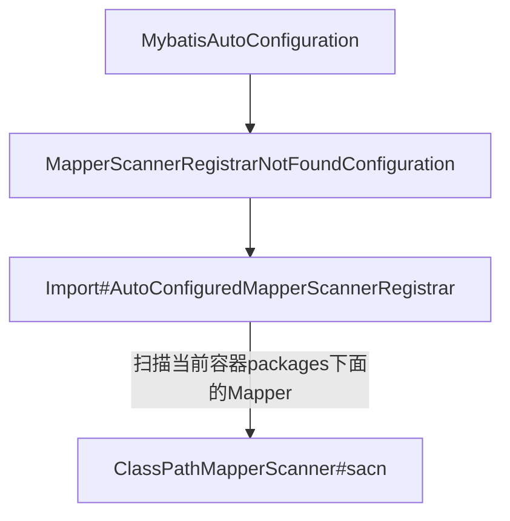
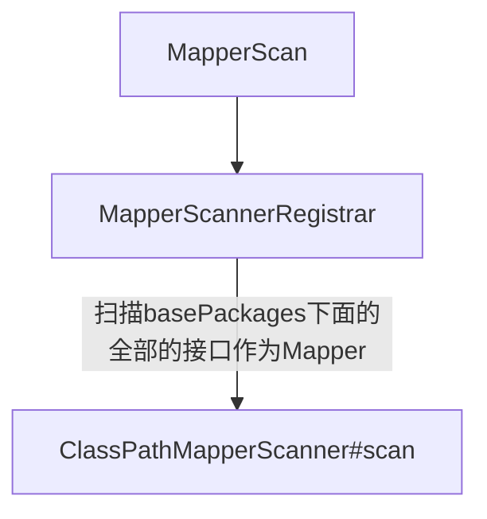

### Spring Boot 项目中 注解方式将Mybatis的数据库访问交给Spring容器管理有两个方式。
1. 在数据库访问类上加Mapper
2. 在启动类上加MapperScan

### 在Mapper上加Mapper为什么Mybatis的数据库访问层Mapper就交给容器管理了。


### 在启动类上加MapperScan将Mapper就交给容器管理


### mybatis 程序调用链
1. MapperProxy
2. MapperMethod#execute
https://www.jianshu.com/p/cc66d112f384

### mybatis 结果映射
DefaultResultSetHandler 具体在这里面处理的。
需要注意的几点：
1. mybatis配置了映射的xml文件的时候。如下：
```xml
<resultMap id="demo" type="com.smallcode.model.Demo">
  <id property="id" column="id"/>
  <result property="name" column="name"/>
  <result property="description" column="description"/>
  <result property="createTime" column="create_time"/>
  <result property="updateTime" column="update_time"/>
</resultMap>
```
- column如果存在，property出错了，程序将出错，
- column不存在，property配置的正确与否都不会出错
- 开启了驼峰，Demo类中没有在以上配置文件没有出现的属性，也会在被赋值。

2. resultMap和resultType的区别
- resultMap 做一层映射
- resultType 直接返回实体