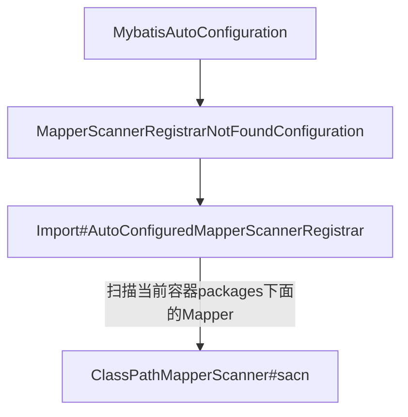
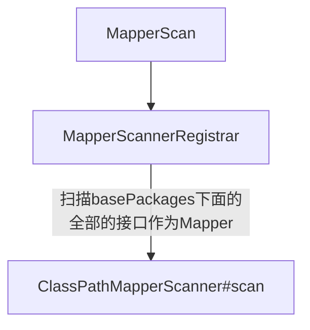

### Spring Boot 项目中 注解方式将Mybatis的数据库访问交给Spring容器管理有两个方式。
1. 在数据库访问类上加Mapper
2. 在启动类上加MapperScan

### 在Mapper上加Mapper为什么Mybatis的数据库访问层Mapper就交给容器管理了。

```mermaid
graph TD;
    A[MybatisAutoConfiguration]-->B[MapperScannerRegistrarNotFoundConfiguration]
    B-->C[Import#AutoConfiguredMapperScannerRegistrar]
    C--扫描当前容器packages下面的Mapper-->D[ClassPathMapperScanner#sacn]
```

### 在启动类上加MapperScan将Mapper就交给容器管理

```mermaid
graph TD;
    A[MapperScan]-->B[MapperScannerRegistrar]
    B--扫描basePackages下面的全部的接口作为Mapper-->C[ClassPathMapperScanner#scan]
```