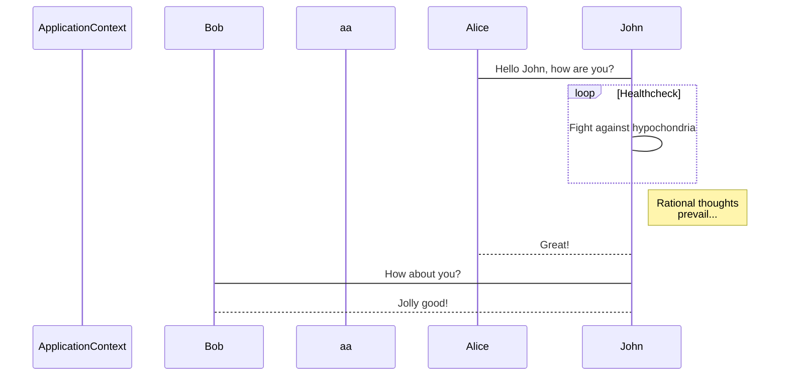
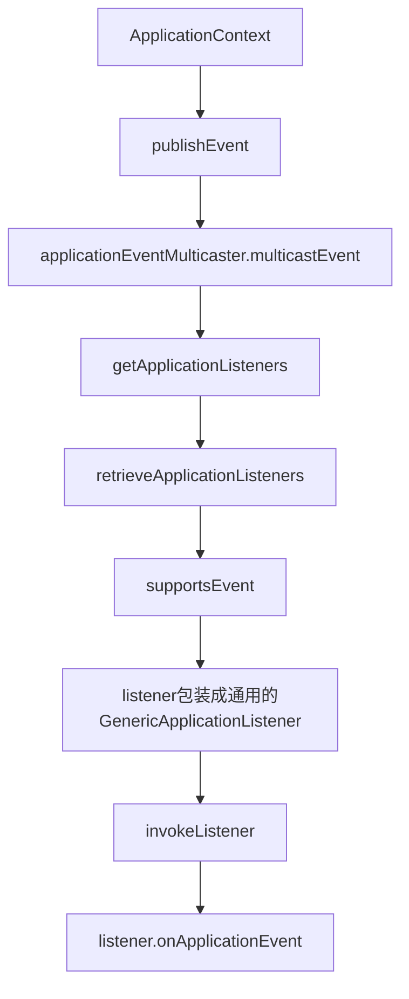

```mermaid
sequenceDiagram
    participant ApplicationContext
    participant Bob
    participant aa

    Alice->John: Hello John, how are you?
    loop Healthcheck
        John->John: Fight against hypochondria
    end
    Note right of John: Rational thoughts <br/>prevail...
    John-->Alice: Great!
    John->Bob: How about you?
    Bob-->John: Jolly good!
```

```mermaid
graph TD;
    ApplicationContext-->publishEvent;
    publishEvent-->applicationEventMulticaster.multicastEvent;

    applicationEventMulticaster.multicastEvent-->getApplicationListeners;
  


    getApplicationListeners-->retrieveApplicationListeners;
    retrieveApplicationListeners-->supportsEvent;
    supportsEvent-->listener包装成通用的GenericApplicationListener;

    listener包装成通用的GenericApplicationListener-->invokeListener;
    
    invokeListener-->listener.onApplicationEvent;
```