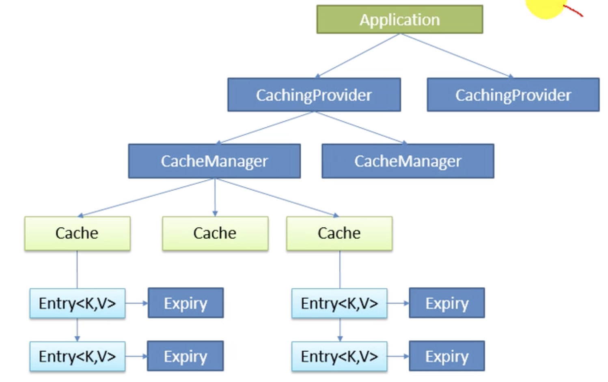

# 加载配置文件位置
SpringBoot启动扫描以下位置的application.properties或者application.yml文件作为Spring boot的默认配置文件

- file:./config/
- file./
- classpath:/config/
- classpath:/


优先级从高到低顺序，高优先级会覆盖低优先级的相同配置；互补配置
也可以通过spring.config.location来改变默认配置

项目打包好了以后，可以使用命令行参数的形式，启动项目的时候来指定配置文件的新位置；指定配置文件和默认的配置文件会共同起作用，互补配置

```shell
java -jar spring-boot-config-02-0.0.1-SNAPSHOT.jar --spring.config.location=E:/work/application.properties
```

运维比较有用，从外部加载，不用修改别的文件

# 引入外部配置

SpringBoot也可以从以下位置加载配置；优先级从高到低；高优先级覆盖低优先级，可以互补

1. 命令行参数

```
java -jar spring-boot-config-02-0.0.1-SNAPSHOT.jar --server.port=9005 --server.context-path=/abc
```
中间一个空格

2. 来自java:comp/env的JNDI属性

3. java系统属性（System.getProperties()）

4. 操作系统环境变量

5. RandomValuePropertySource配置的random.*属性值


优先加载profile, 由jar包外到jar包内

6. jar包外部的application-{profile}.properties或application.yml(带Spring.profile)配置文件

7. jar包内部的application-{profile}.properties或application.yml(带Spring.profile)配置文件

8. jar包外部的application.properties或application.yml(带Spring.profile)配置文件

9. jar包内部的application.properties或application.yml(不带spring.profile)配置文件


10. @Configuration注解类的@PropertySource

11. 通过SpringApplication.setDefaultProperties指定的默认属性


https://docs.spring.io/spring-boot/docs/2.0.1.RELEASE/reference/htmlsingle/#boot-features-external-config

# 自动配置原理

1)、利用@EnableAutoConfiguration

2)、 AutoConfigurationImportSelector中selectImports()方法里面有
```java
List<String> configurations = this.getCandidateConfigurations(annotationMetadata, attributes);
```
得到所有的候选的Configuration。

3)、 SpringFactoriesLoader.loadFactoryNames()
 - 扫描所有jar包类路径下的 MATA-INF/spring.factories
 - 把扫描到的这些文件的内容包装成properties对象
 - 从properties中获取到EnableAutoConfiguration.class类（类名）对应的值，然后把他们添加到容器中

## spring boot 精髓
- 组件 start 自动装配
- start 的AutoConfiguration 跟 配置文件properties 绑定
- 通过 @EnableConfigurationProperties(HttpEncodingProperties.class) 指定配置类
```
@ConfigurationProperties(prefix = "spring.http.encoding")
public class HttpEncodingProperties {
```
HttpEncodingProperties指定配置文件配置。

- 查看springboot 加载哪些AutoConfiguration。
在配置文件加
debug=true;在控制台打印配置报告。

## spring boot 配置

- 实现或者继承xxxxConfigure重写某些配置
- 实现或者继承 Customizer重写某些配置

## spring boot 日志

#### spring boot 统一日志 

将项目中其他的框架如spring(common-logging),Hibernate(jboss-logging).xxx 框架使用的日志框架去掉，引用sl4f中间转换层，转换成使用slf4规范的框架。


```
<dependencies>
	<dependency>
		<groupId>ch.qos.logback</groupId>
		<artifactId>logback-classic</artifactId>
	</dependency>
	<dependency>
		<groupId>org.slf4j</groupId>
		<artifactId>jcl-over-slf4j</artifactId>
	</dependency>
	<dependency>
		<groupId>org.slf4j</groupId>
		<artifactId>jul-to-slf4j</artifactId>
	</dependency>
	<dependency>
		<groupId>org.slf4j</groupId>
		<artifactId>log4j-over-slf4j</artifactId>
	</dependency>
</dependencies>
```

将spring，hibernate使用的日志框架偷梁换柱。


spring,hibernate框架要排除自己的日志框架。


这样的话，使用spring-boot开发的项目将日志全部统一成使用slf4j的日志框架。

```
<dependency>
        <groupId>org.springframework.boot</groupId>
        <artifactId>spring-boot-starter-logging</artifactId>
</dependency>
```

#### spring boot 默认日志

自定义配置
- logback.xml放到classpath路径下日志框架加载该配置
- spring-logbakc.xml放到classpath路径下spring 加载该配置
- 


## spring boot web

#### spring boot web  静态资源配置
在org.springframework.boot.autoconfigure.web.WebMvcAutoConfiguration.WebMvcAutoConfigurationAdapter 配置文件下。
```
// 配置静态文件存放路径
@Override
public void addResourceHandlers(ResourceHandlerRegistry registry) {
	if (!this.resourceProperties.isAddMappings()) {
		logger.debug("Default resource handling disabled");
		return;
	}
	Integer cachePeriod = this.resourceProperties.getCachePeriod();
	if (!registry.hasMappingForPattern("/webjars/**")) {
		customizeResourceHandlerRegistration(registry
				.addResourceHandler("/webjars/**")
				.addResourceLocations("classpath:/META-INF/resources/webjars/")
				.setCachePeriod(cachePeriod));
	}
	String staticPathPattern = this.mvcProperties.getStaticPathPattern();
	if (!registry.hasMappingForPattern(staticPathPattern)) {
		customizeResourceHandlerRegistration(
				registry.addResourceHandler(staticPathPattern)
						.addResourceLocations(
								this.resourceProperties.getStaticLocations())
						.setCachePeriod(cachePeriod));
	}
}

// 欢迎页面
@Bean
public WelcomePageHandlerMapping welcomePageHandlerMapping(
		ResourceProperties resourceProperties) {
	return new WelcomePageHandlerMapping(resourceProperties.getWelcomePage(),
			this.mvcProperties.getStaticPathPattern());
}

// 欢迎页面放到静态页面的index.html文件
private String[] getStaticWelcomePageLocations() {
	String[] result = new String[this.staticLocations.length];
	for (int i = 0; i < result.length; i++) {
		String location = this.staticLocations[i];
		if (!location.endsWith("/")) {
			location = location + "/";
		}
		result[i] = location + "index.html";
	}
	return result;
}

// 网站图标
@Configuration
@ConditionalOnProperty(value = "spring.mvc.favicon.enabled", matchIfMissing = true)
public static class FaviconConfiguration {

	private final ResourceProperties resourceProperties;

	public FaviconConfiguration(ResourceProperties resourceProperties) {
		this.resourceProperties = resourceProperties;
	}

	@Bean
	public SimpleUrlHandlerMapping faviconHandlerMapping() {
		SimpleUrlHandlerMapping mapping = new SimpleUrlHandlerMapping();
		mapping.setOrder(Ordered.HIGHEST_PRECEDENCE + 1);
		mapping.setUrlMap(Collections.singletonMap("**/favicon.ico",
				faviconRequestHandler()));
		return mapping;
	}

	@Bean
	public ResourceHttpRequestHandler faviconRequestHandler() {
		ResourceHttpRequestHandler requestHandler = new ResourceHttpRequestHandler();
		requestHandler
				.setLocations(this.resourceProperties.getFaviconLocations());
		return requestHandler;
	}

}
```
- 静态文件存放路径：
"classpath:/META-INF/resources/", "classpath:/resources/",
	​		"classpath:/static/", "classpath:/public/"
- 欢迎页面放到静态页面的index.html文件


#### spring mvc

- spring boot 对spring mvc 做了自动配置，WebMvcAutoConfiguration
- 在webConfiguration中配置viewcontroller 直接可以路径匹配到页面，不用写controller
- 国际化LocalResolver
- ctrl+f9 刷新模板引擎修改的内容
- 错误处理ErrorMvcAutoConfiguration
    - BasicErrorController 错误的controller处理
    - ErrorPageCustomizer 找到错误页面路径
    - DefaultErrorAttributes 错误信息封装 可自定义，错误信息
    - 

#### spring boot 内置servlet容器
- 修改servlet容器相关的配置，
    - 修改通用配置 server.xxxx 相关的配置
    - 修改tomcat配置server.tomcat.xxx
    - 通过EmbeddedServletContainerCustomizer 来配置

#### 注册三大组件 Servlet,Filter,Listener
- ServletRegistrationBean 注册DispatcherServletServlet
- Filter，Listener 同理


#### 启动其他的servlet容器
- 排除tomcat-starter
- 引入jetty-starter或者其他的容器


#### 嵌入式servlet容器的注入
- 在EmbeddedServletContainerAutoConfiguration里面注入TomcatEmbeddedServletContainerFactory，JettyEmbeddedServletContainerFactory，UndertowEmbeddedServletContainerFactory，利用抽象工厂的模式


- 修改配置原理
    - EmbeddedServletContainerAutoConfiguration上面BeanPostProcessorsRegistrar 注入后置处理器EmbeddedServletContainerCustomizerBeanPostProcessor
    - 注入后置处理器EmbeddedServletContainerCustomizerBeanPostProcessor 在bean初始化之前利用EmbeddedServletContainerCustomizer 给容器配置

#### 嵌入式ServletContainer 启动原理

org.springframework.boot.context.embedded.EmbeddedWebApplicationContext#onRefresh
- spring boot 应用启动执行run方法
-  创建IOc容器
    - 如果是web应用创建AnnotationConfigEmbeddedWebApplicationContext
    - 如果不是web应用创建AnnotationConfigApplicationContext
- refreshContext(context); 刷新ioc容器
- 执行容器的onfresh方法，执行EmbeddedWebApplicationContext的onfresh方法
- createEmbeddedServletContainer 创建servlet容器
- 利用EmbeddedServletContainerFactory创建servlet容器，并启动容器
- 先启动SpringApplication在启动Servlet容器

#### 使用外置的Servlet容器

嵌入式的Servlet容器优缺点
- 优点：简单，便利
- 缺点：默认不支持jsp，优化定制比较复杂


使用外置的Servlet容器：
- 创建一个war项目
- 将容器的maven引用改成provided
```xml
 <dependency>
    <groupId>org.springframework.boot</groupId>
    <artifactId>spring-boot-starter-tomcat</artifactId>
    <scope>provided</scope>
</dependency>
```
>对于scope=compile的情况（默认scope),也就是说这个项目在编译，测试，运行阶段都需要这个artifact(模块)对应的jar包在classpath中。 
而对于scope=provided的情况，则可以认为这个provided是目标容器已经provide这个artifact。换句话说，==它只影响到编译，测试阶段。在编译测试阶段==，我们需要这个artifact对应的jar包在classpath中，而在运行阶段，假定目标的容器（比如我们这里的liferay容器）已经提供了这个jar包，所以无需我们这个artifact对应的jar包了。

- 编写一个SpringBootServletInitializer子类
```
public class ServletInitializer extends SpringBootServletInitializer {

	@Override
	protected SpringApplicationBuilder configure(SpringApplicationBuilder application) {
		return application.sources(DemoApplication.class);
	}

}

```
- 采用原来的项目的方式添加tomcat，启动项目。

使用外置容器的原理
- SpringBootServletInitializer 实现了WebApplicationInitializer 是 ServletContainerInitializer 的实现类SpringBootServletInitializer，在容器启动的时候会调用SpringBootServletInitializer的onStartup方法
```java
protected WebApplicationContext createRootApplicationContext(
			ServletContext servletContext) {
	SpringApplicationBuilder builder = createSpringApplicationBuilder();
	builder.main(getClass());
	ApplicationContext parent = getExistingRootWebApplicationContext(servletContext);
	if (parent != null) {
		this.logger.info("Root context already created (using as parent).");
		servletContext.setAttribute(
				WebApplicationContext.ROOT_WEB_APPLICATION_CONTEXT_ATTRIBUTE, null);
		builder.initializers(new ParentContextApplicationContextInitializer(parent));
	}
	builder.initializers(
			new ServletContextApplicationContextInitializer(servletContext));
	builder.contextClass(AnnotationConfigEmbeddedWebApplicationContext.class);
	// 配置SpringApplicationBuilder 这里调用子类的configure方法 配置主启动类
	builder = configure(builder);
	builder.listeners(new WebEnvironmentPropertySourceInitializer(servletContext));
	SpringApplication application = builder.build();
	if (application.getSources().isEmpty() && AnnotationUtils
			.findAnnotation(getClass(), Configuration.class) != null) {
		application.getSources().add(getClass());
	}
	Assert.state(!application.getSources().isEmpty(),
			"No SpringApplication sources have been defined. Either override the "
					+ "configure method or add an @Configuration annotation");
	// Ensure error pages are registered
	if (this.registerErrorPageFilter) {
		application.getSources().add(ErrorPageFilterConfiguration.class);
	}
	// 启动application
	return run(application);
}
```
- 调用子类的实现配置SpringApplicationBuilder主类
- 在调用run方法让Application启动起来，达到了跟直接springboot jar 一样的效果
- ServletContextApplicationContextInitializer 中设置了ServletContext。
- SpringApplication 中prepareContext方法，applyInitializers(context)，ServletContextApplicationContextInitializer的initialize执行，传入applicationcontext，将创建的servletcontext赋值给传入applicationcontext
- 先启动web容器，在启动SpringApplication
- 让后执行到EmbeddedWebApplicationContext的onRefresh，再到createEmbeddedServletContainer
```
private void createEmbeddedServletContainer() {
	EmbeddedServletContainer localContainer = this.embeddedServletContainer;
	ServletContext localServletContext = getServletContext();
	// 判断容器是不是存在
	if (localContainer == null && localServletContext == null) {
		EmbeddedServletContainerFactory containerFactory = getEmbeddedServletContainerFactory();
		this.embeddedServletContainer = containerFactory
				.getEmbeddedServletContainer(getSelfInitializer());
	}
	// 已经存在不执行创建嵌入式容器的操作
	else if (localServletContext != null) {
		try {
			getSelfInitializer().onStartup(localServletContext);
		}
		catch (ServletException ex) {
			throw new ApplicationContextException("Cannot initialize servlet context",
					ex);
		}
	}
	initPropertySources();
}
```
- ServletContext 已经存在不会执行创建操作

## spring boot 数据访问

#### DataSourceConfiguration 数据源配置
- 根据类型加载数据源，org.apache.tomcat.jdbc.pool.DataSource是默认的数据源
- 还可以加载的数据源HikariDataSource，DBCP，


#### DataSourceAutoConfiguration

##### 注入DataSourceInitializer
DataSourceInitializer为数据初始化器，
```java
// 初始化完成之后执行
@PostConstruct
public void init() {
	if (!this.properties.isInitialize()) {
		logger.debug("Initialization disabled (not running DDL scripts)");
		return;
	}
	if (this.applicationContext.getBeanNamesForType(DataSource.class, false,
			false).length > 0) {
		this.dataSource = this.applicationContext.getBean(DataSource.class);
	}
	if (this.dataSource == null) {
		logger.debug("No DataSource found so not initializing");
		return;
	}
	// 执行建表语句
	runSchemaScripts();
}

private void runSchemaScripts() {
	List<Resource> scripts = getScripts("spring.datasource.schema",
			this.properties.getSchema(), "schema");
	if (!scripts.isEmpty()) {
		String username = this.properties.getSchemaUsername();
		String password = this.properties.getSchemaPassword();
		runScripts(scripts, username, password);
		try {
		  // 建表完成发布建表完成事件
			this.applicationContext
					.publishEvent(new DataSourceInitializedEvent(this.dataSource));
			// The listener might not be registered yet, so don't rely on it.
			if (!this.initialized) {
				runDataScripts();
				this.initialized = true;
			}
		}
		catch (IllegalStateException ex) {
			logger.warn("Could not send event to complete DataSource initialization ("
					+ ex.getMessage() + ")");
		}
	}
}

// 收到建表完成事件，开始执行数据库操作
@Override
public void onApplicationEvent(DataSourceInitializedEvent event) {
	if (!this.properties.isInitialize()) {
		logger.debug("Initialization disabled (not running data scripts)");
		return;
	}
	// NOTE the event can happen more than once and
	// the event datasource is not used here
	if (!this.initialized) {
		runDataScripts();
		this.initialized = true;
	}
}

//  得到script文件
private List<Resource> getScripts(String propertyName, List<String> resources,
			String fallback) {
	if (resources != null) {
		return getResources(propertyName, resources, true);
	}
	String platform = this.properties.getPlatform();
	List<String> fallbackResources = new ArrayList<String>();
	fallbackResources.add("classpath*:" + fallback + "-" + platform + ".sql");
	fallbackResources.add("classpath*:" + fallback + ".sql");
	return getResources(propertyName, fallbackResources, false);
}
	
	
```
==这样先执行schema-*.sql，在执行data-*.sql==

- schema.sql, schema-all.sql
- 直接指定schema
- data.sql,data-all.sql
- 直接指定data文件

```yml
spring:
  datasource:
    username: root
    password: 123456
    url: jdbc:mysql://localhost:3310/blog1
    driver-class-name: com.mysql.jdbc.Driver
    schema:
      - classpath:schema-article.sql
    data:
      - classpath:data-bb.sql
```


#### JdbcTemplateAutoConfiguration
- 注入jdbcTemplate jdbc操作模板

```java
List<Map<String, Object>> maps = jdbcTemplate.queryForList("select * from b_article");

```

#### 切换数据源：Druid
采用druid 当做数据源。
```xml
<dependency>
    <groupId>com.alibaba</groupId>
    <artifactId>druid</artifactId>
    <version>1.1.12</version>
</dependency>
```
修改配置文件指定数据源
```yml
spring:
  datasource:
    username: root
    password: 123456
    url: jdbc:mysql://localhost:3310/blog1
    driver-class-name: com.mysql.jdbc.Driver
    #type: com.alibaba.druid.pool.DruidDataSource

    
    ###################以下为druid增加的配置###########################
    type: com.alibaba.druid.pool.DruidDataSource
    # 下面为连接池的补充设置，应用到上面所有数据源中
    # 初始化大小，最小，最大
    initialSize: 5
    minIdle: 5
    maxActive: 20
    # 配置获取连接等待超时的时间
    maxWait: 60000
    # 配置间隔多久才进行一次检测，检测需要关闭的空闲连接，单位是毫秒
    timeBetweenEvictionRunsMillis: 60000
    # 配置一个连接在池中最小生存的时间，单位是毫秒
    minEvictableIdleTimeMillis: 300000
    validationQuery: SELECT 1 FROM DUAL
    testWhileIdle: true
    testOnBorrow: false
    testOnReturn: false
    # 打开PSCache，并且指定每个连接上PSCache的大小
    poolPreparedStatements: true
    maxPoolPreparedStatementPerConnectionSize: 20
    # 配置监控统计拦截的filters，去掉后监控界面sql无法统计，'wall'用于防火墙
    filters: stat,wall,log4j
    # 通过connectProperties属性来打开mergeSql功能；慢SQL记录
    connectionProperties: druid.stat.mergeSql=true;druid.stat.slowSqlMillis=5000
    # 合并多个DruidDataSource的监控数据
    useGlobalDataSourceStat: true
    ###############以上为配置druid添加的配置########################################

#    schema:
#      - classpath:schema-article.sql
#    data:
#      - classpath:data-bb.sql
```

```java
@Configuration
public class DruidConfig {

	/**
	 * 配置数据源
	 * 根据配置创建DruidDatasource
	 * @return
	 */
	@ConfigurationProperties(prefix = "spring.datasource")
	@Bean
	public DataSource dataSource() {
		return new DruidDataSource();
	}

	/**
	 * 1、配置一个管理后台的servlet
	 * @return
	 */
	@Bean
	public ServletRegistrationBean statViewServlet() {
		ServletRegistrationBean servletRegistrationBean = new ServletRegistrationBean(new StatViewServlet(), "/druid/*");

		Map<String, String> initMap = new HashMap<>();
		initMap.put("loginUsername", "root");
		initMap.put("loginPassword", "root");
		initMap.put("allow", "127.0.0.1");

		servletRegistrationBean.setInitParameters(initMap);

		return servletRegistrationBean;
	}

	/***
	 * 2.配置web监控的filter
	 * @return
	 */
	@Bean
	public FilterRegistrationBean webStatFilter() {
		FilterRegistrationBean filterRegistrationBean = new FilterRegistrationBean();
		filterRegistrationBean.setFilter(new WebStatFilter());

		Map<String, String> initMap = new HashMap<>();
		// 过滤一些跟数据库查询无关的
		initMap.put("exclusions", "*.js,*.css,/druid/*");
		filterRegistrationBean.setInitParameters(initMap);

		filterRegistrationBean.setUrlPatterns(Arrays.asList("/*"));
		return filterRegistrationBean;
	}

}
```

不指定默认是org.apache.tomcat.jdbc.pool.DataSource

#### spring mybatis 
引入mybatis-spring-boot的支持。 可以不用修改任何配置，配置已经默认定义。可以采用mybatis注解的形式进行编写mybatis访问数据库。

如果想修改配置：可以通过配置类来修改。
ConfigurationCustomizer

开启驼峰的形式：
```
spring:
  datasource:
    username: root
    password: 123456
    url: jdbc:mysql://localhost:3310/blog1
    driver-class-name: com.mysql.jdbc.Driver

mybatis:
  configuration:
    map-underscore-to-camel-case: true #开启驼峰映射
```
或者用配置文件的形式：
```java
@org.springframework.context.annotation.Configuration
public class MyConfigurationCustomizer implements ConfigurationCustomizer {

	@Override
	public void customize(Configuration configuration) {
		configuration.setMapUnderscoreToCamelCase(true);
	}
}
```

在数据访问类上加Mapper，或者在启动类上加MapperScan。


### 统一数据库操作
spring boot 使用spring-data统一数据访问操作。
- spring-data-jpa:统一java各种数据操作的api（主要是统一orm），默认操作采用hibernate底层。
- spring-data-redis:统一reidis操作


## starter
### 自定义starter
- 建立sample-spring-boot-autoconfigur : 建立默认配置文件
- 建立一个sample-spring-boot-starter 依赖sample-spring-boot-autoconfigure

## 缓存

### JSR107规范

缓存**JSR107** 规范有下面几个概念：

- CachingProvider:配置、创建、管理、创建、多个CacheManager；字面意思缓存提供者。
- CacheManager:配置、创建、管理、创建、多个Cache，一个CacheManager位于一个CachingProvider下面
- Cahce：类似Map的s数据接口，key-value的形式，一个cache对应一个CacheManager
- Entry：一个存储在Cache里面的key-value对
- Expiry：每一个存储在Cache里面的条目都有一个有效期，有效期可以通过ExpiryPolicey设置

层级关系如下：



### Spring 缓存抽象

