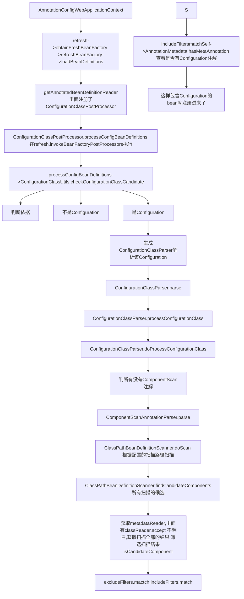

```mermaid
graph TD;
    A[AnnotationConfigWebApplicationContext]-->B[refresh->obtainFreshBeanFactory->refreshBeanFactory->loadBeanDefinitions] 
    B-->C[getAnnotatedBeanDefinitionReader里面注册了ConfigurationClassPostProcessor]
    C-->D[ConfigurationClassPostProcessor.processConfigBeanDefinitions 在refresh.invokeBeanFactoryPostProcessors执行]
    D-->E[processConfigBeanDefinitions->ConfigurationClassUtils.checkConfigurationClassCandidate]
    E-->F0[判断依据]
    E-->F1[不是Configuration]
    E-->F2[是Configuration]
    F2-->G[生成ConfigurationClassParser解析该Configuration]
    G-->H[ConfigurationClassParser.parse]
    H-->I[ConfigurationClassParser.processConfigurationClass]
    I-->J[ConfigurationClassParser.doProcessConfigurationClass]
    J-->K[判断有没有ComponentScan注解]
    K-->L[ComponentScanAnnotationParser.parse]
    L-->M[ClassPathBeanDefinitionScanner.doScan 根据配置的扫描路径扫描]
    M-->O[ClassPathBeanDefinitionScanner.findCandidateComponents所有扫描的候选]
    O-->P[获取metadataReader,里面有classReader.accept 不明白,获取扫描全部的结果,筛选扫描结果isCandidateComponent]
    P-->R[excludeFilters.mactch,includeFilters.match]
    S-->T[includeFiltersmatchSelf->AnnotationMetadata.hasMetaAnnotation 查看是否有Configuration注解]
    T-->这样包含Configuration的bean就注册进来了

```

- 容器注册BeanDefinition是分开的。
- 先注册一部分，首先注册指定的配置文件Configuration(rootConfig)
- 再由rootConfig的上配置的ComponentScan 扫描别的bean