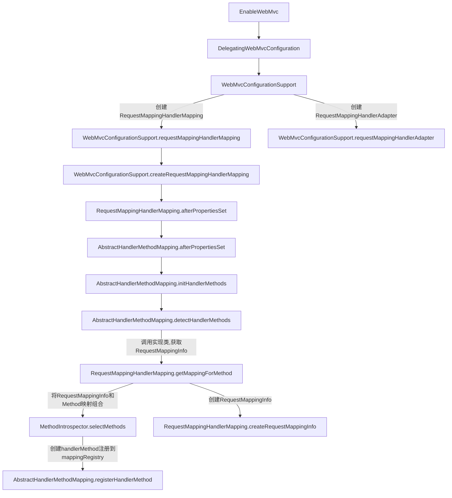
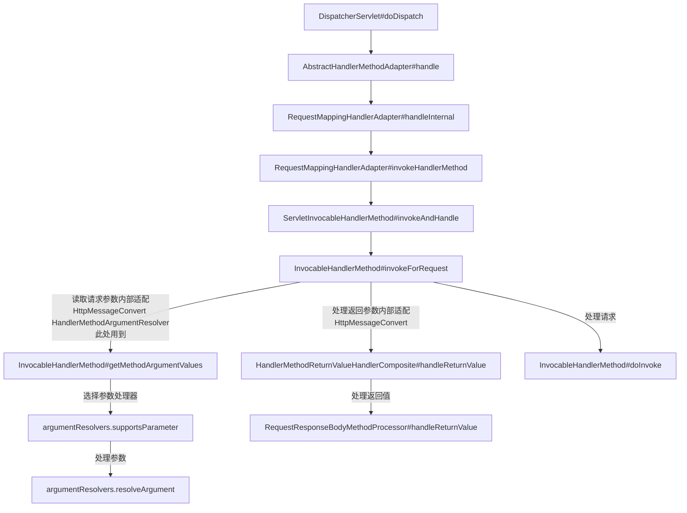

## spring mvc handler 创建过程

## 以@ResponseBody 为例说明 HttpMessageConvert 请求的解析与结果的写入

## spring mvc messageconvert

- httpmessageconvert 查看
https://www.cnblogs.com/fangjian0423/p/springMVC-xml-json-convert.html

- HandlerMethodReturnValueHandlerComposite 查看
http://www.cnblogs.com/fangjian0423/p/springMVC-request-param-analysis.html

