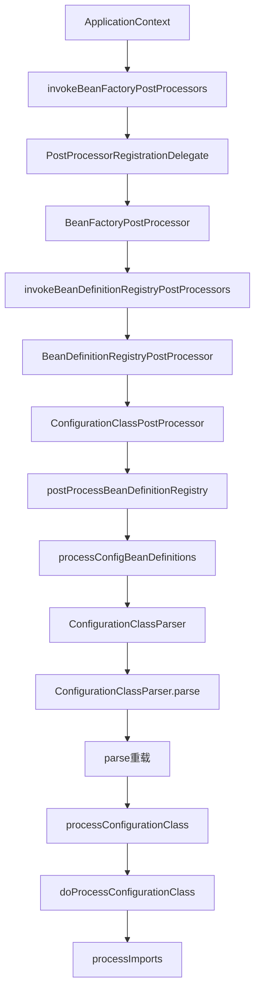
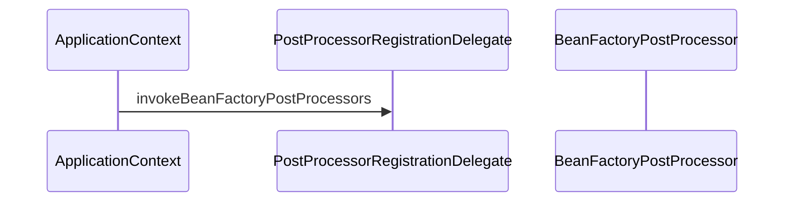

org.springframework.context.annotation.ConfigurationClassParser#processImports

```java
if (candidate.isAssignable(ImportSelector.class)) {
						// Candidate class is an ImportSelector -> delegate to it to determine imports
						Class<?> candidateClass = candidate.loadClass();
						ImportSelector selector = BeanUtils.instantiateClass(candidateClass, ImportSelector.class);
						ParserStrategyUtils.invokeAwareMethods(
								selector, this.environment, this.resourceLoader, this.registry);
						if (this.deferredImportSelectors != null && selector instanceof DeferredImportSelector) {
							this.deferredImportSelectors.add(
									new DeferredImportSelectorHolder(configClass, (DeferredImportSelector) selector));
						}
						else {
							String[] importClassNames = selector.selectImports(currentSourceClass.getMetadata());
							Collection<SourceClass> importSourceClasses = asSourceClasses(importClassNames);
							processImports(configClass, currentSourceClass, importSourceClasses, false);
						}
					}
					else if (candidate.isAssignable(ImportBeanDefinitionRegistrar.class)) {
						// Candidate class is an ImportBeanDefinitionRegistrar ->
						// delegate to it to register additional bean definitions
						Class<?> candidateClass = candidate.loadClass();
						ImportBeanDefinitionRegistrar registrar =
								BeanUtils.instantiateClass(candidateClass, ImportBeanDefinitionRegistrar.class);
						ParserStrategyUtils.invokeAwareMethods(
								registrar, this.environment, this.resourceLoader, this.registry);
						configClass.addImportBeanDefinitionRegistrar(registrar, currentSourceClass.getMetadata());
					}
					else {
						// Candidate class not an ImportSelector or ImportBeanDefinitionRegistrar ->
						// process it as an @Configuration class
						this.importStack.registerImport(
								currentSourceClass.getMetadata(), candidate.getMetadata().getClassName());
						processConfigurationClass(candidate.asConfigClass(configClass));
					}
```


