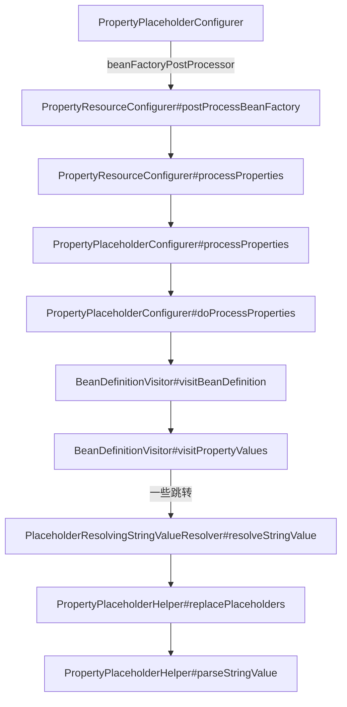

```mermaid
 graph TD;
  A[PropertyPlaceholderConfigurer]--beanFactoryPostProcessor-->B[PropertyResourceConfigurer#postProcessBeanFactory]
  B-->C[PropertyResourceConfigurer#processProperties]
  C-->D[PropertyPlaceholderConfigurer#processProperties]
  D-->E[PropertyPlaceholderConfigurer#doProcessProperties]
  E-->F[BeanDefinitionVisitor#visitBeanDefinition]
  F-->G[BeanDefinitionVisitor#visitPropertyValues]
  G--一些跳转-->H[PlaceholderResolvingStringValueResolver#resolveStringValue]
  H-->I[PropertyPlaceholderHelper#replacePlaceholders]
  I-->J[PropertyPlaceholderHelper#parseStringValue]
```

## 一些用法

#### 按照,截取
```java
@Value("#{'${ublacklist}'.split(',')}")
  private List<String> blacklist;
```